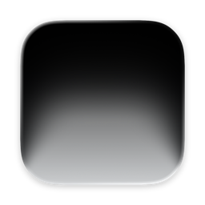

# Duoveil

A little magic for your MacBook. Your desktop bends and softly blurs as you close the lid.

[Duoveil on Gumroad](https://7517229897335.gumroad.com/l/duoveil)

## Updates

This repository hosts Duoveil’s signed update feed and release downloads.
[Download Duoveil 1.0.0 (build 21)](https://github.com/esgvio/Duoveil/releases/download/v1.0.0-build.21/Duoveil-1.0.0-21-arm64.dmg)

Build 21 adds a Dim slider, Reset for all four sliders, a Lock Screen toggle,
and a fix for the installer background. Existing installations can update from
**Check for Updates…** in Duoveil’s menu.

The Gumroad edition requires a license key to enable the effect.
Requires macOS 14 or later, Apple silicon, and a readable MacBook lid-angle sensor.
